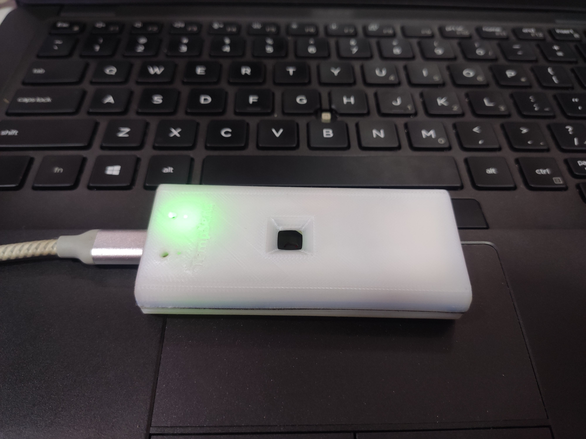
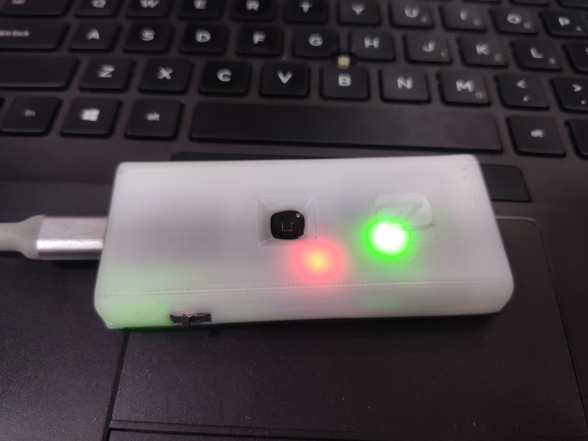
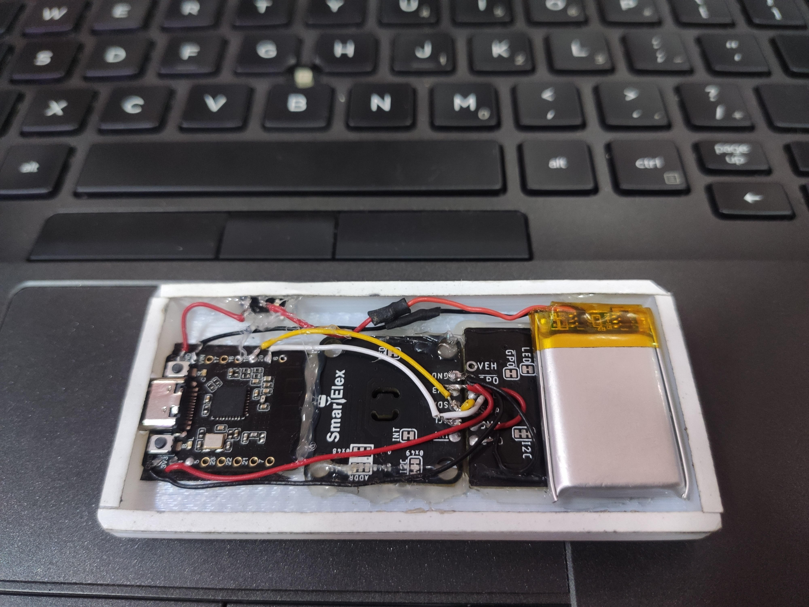

# NFC-TEMP_SENS
Gen 1 prototype of a contact-based temperature screening system using ESP32-C6 and NFC. Measures body temperature via Medical grade TMP117, stores data on an ST25DV64KC NFC tag, and supports smartphone tap-to-read + cloud sync for patient analytics.
# NFC-Based Smart Temperature Logger (Gen 1)

Gen-1 prototype: **ESP32-C6 Mini** + **TMP117** for contact body temperature, stores session data on **ST25DV64KC NFC tag** (tap with a smartphone to view) and can **send data to a server** for analysis. Each session records **12 readings in ~1 minute**, classifies **Normal / Fever / High Fever**, and saves a compact NDEF text payload to the NFC tag.

## ✨ Features
- Medical-grade temp sensor: **TMP117**
- NFC tag with dynamic memory: **ST25DV64KC**
- **ESP32-C6 Mini** (Wi-Fi + BT)
- **12 readings**/session (5s interval, ~60s total)
- Tap **smartphone → see temp + status**
- **HTTP POST** to server with session data
- **Patient ID** support (basic placeholder)

## 🧰 Hardware
| Part | Notes |
|---|---|
| ESP32-C6 Mini | 3.3V, I²C (SDA/SCL), Wi-Fi |
| TMP117 | I²C 0x48 (default), ±0.1°C typical |
| ST25DV64KC | NFC/RFID dynamic tag, I²C 0x53 |
| Finger contact | Ensure consistent placement/pressure |

## 📸 Prototype Gallery (placeholder)

.

## 🧱 3D Model & Enclosure (placeholder)

- [Enclosure Bottom (STL)](3D%20Model/SENS_enclosure_bottom.stl)
- [Enclosure top (STL)](3D%20Model/SENS_enclosure_top.stl)

  
  [Download STL](3D%20Model/SENS_enclosure_bottom.stl)

  
  [Download STL](3D%20Model/SENS_enclosure_top.stl)

## 🚦 Status thresholds (default)
- **Normal**: `< 37.5°C` (99.5°F)
- **Fever**: `≥ 37.5°C and < 38.9°C` (102.0°F)
- **High Fever**: `≥ 38.9°C`

> You can adjust these in `firmware/include/config.h`.

## 🔌 Firmware
- Arduino-style C++ (works in Arduino IDE or PlatformIO)
- I²C: TMP117 + ST25DV64KC
- Writes **NDEF Text** record: e.g. `T=37.8C; S=Fever; N=12; ts=2025-08-18T12:03:21Z; pid=abc123`

### Quick start (Arduino IDE)
1. Install **ESP32 boards** (Board Manager).
2. Open `firmware/src/main.cpp`.
3. Copy `firmware/include/secrets.h.example` → `secrets.h` and fill Wi-Fi + server.
4. Select your ESP32-C6 board, compile & upload.
5. Open Serial Monitor @ 115200.
